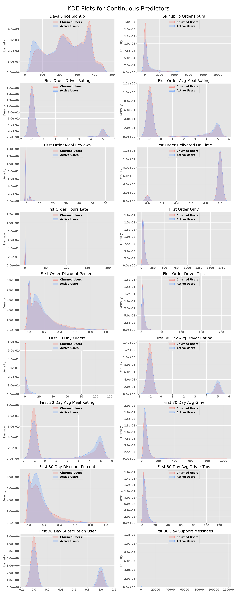
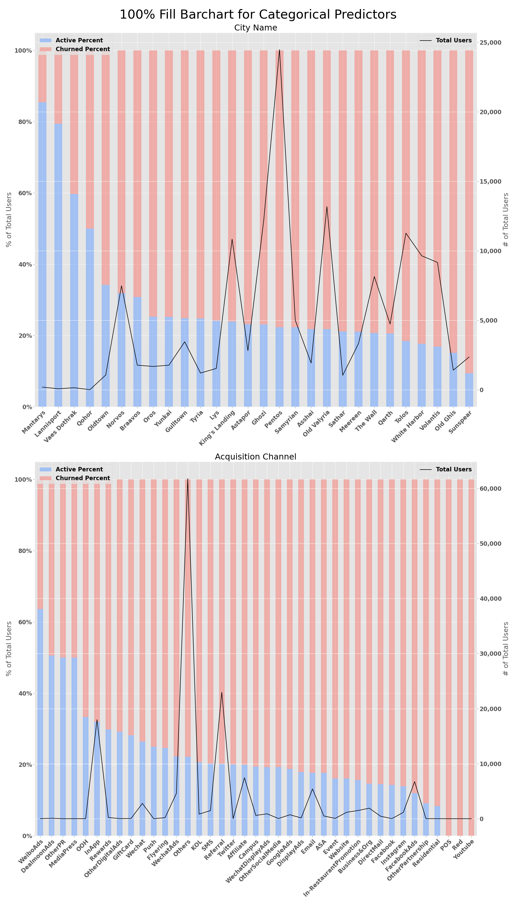
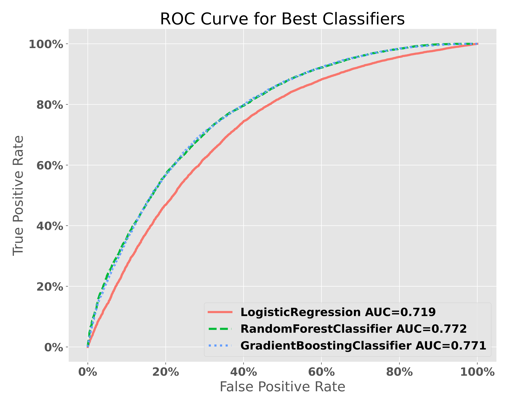
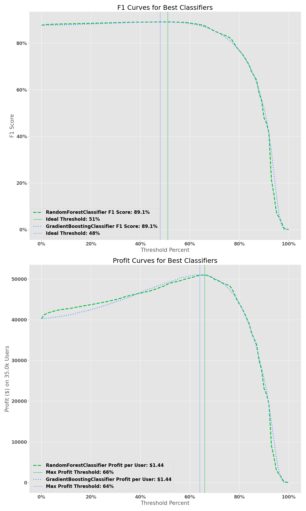

# Predicting User Churn

## Background
Food Delivery Company X saw substantial user growth as lockdowns started and restaurants shutdown in-person dining beginning mid-March in 2013. More and more people turned to app based delivery platforms to enjoy their favorite food from local restaurants. One year later, with vaccinations rolling out and more restaurants opening in person dining, their growth in active users has started to plateau and the CEO wants to dig in to what's causing it and what they can do to prevent it.

Using Supervised Machine Learning models, I will attempt to predict the probability a user will churn based of their signup data, first order data, and first 30 days on the platform. 

$$\large \text{Churned User (+ Class)} = \text{A user who's last order was > 30 days ago}$$
$$\large \text{Active User (- Class)} = \text{A user who's last order was <= 30 days ago}$$

---

## Dataset
My dataset is pulled from Company X's database using their preferred query editor. In order to protect their data and identity, I converted any identifying city names and stored the data in a private AWS S3 bucket to use for later analysis.

### Features
The features I pulled included:

| Feature Name                   | Data Type | Description |
|--------------------------------|-----------|-------------|
| city_name                      | String    | The city the user placed their first order in. Changed to protect the company's identity and data. |
| city_group                     | String    | One of `college town` or `city` based on the city's population size and presence of a university. |
| signup_time_utc                | DateTime  | The date and time the user signed up on the platform in Coordinated Universal Time. |
| is_foreign_user                | Boolean   | Whether or not the user is domestic to the US. |
| acquisition_category           | String    | The acquisition channel a user signed up through (Referrals, Digital Ads, Social Media, etc). |
| acquisition_subcategory        | String    | The acquisition channel's subcategory a user signed up through (Facebook, Snapchat, In-restaurant promotions, etc). |
| language                       | String    | The user selected language they prefer. Can be Unknown is not-selected. |
| last_order_time_utc            | DateTime  | The date and time of the user's last order on the platform in Coordinated Universal Time. **This is used to calculate the positive and negative class.**|
| signup_to_order_hours          | Float     | The number of hours between signing up and a user's first order. |
| days_since_signup              | Integer   | The number of days since a user has signed up. |
| first_order_driver_rating      | Integer   | The optional rating a user gave their courier on their first order. Can be -1 if there was no rating. |
| first_order_avg_meal_rating    | Float     | The optional average rating a user gave their meals on their first order. Can be -1 if there were no ratings. An order can have multiple meals included. |
| first_order_median_meal_rating | Float     |The optional median rating a user gave their meals on their first order. Can be -1 if there were no ratings. An order can have multiple meals included.|
| first_order_delivered_on_time  | Boolean   | Whether or not a user's first order was delivered by the time promised in the app. |
| first_order_hours_late         | Float     | The number of hours late a user's first order was delivered. If an order was delivered on time, this equals 0. |
| first_order_gmv                | Float     | The Gross Merchandise Value (in USD) of a user's first order. This is the total cost of an order, including things like taxes, fees, and tips. |
| first_order_payment            | Float     | The amount a user paid the Company on their first order (in USD). This is net of the promos or discounts a user was offered. |
| first_order_discount_amount    | Float     | The difference between the GMV and an order payment (in USD). This is equal to any promos or discounts a user was offered. |
| first_order_discount_percent   | Float     | The % of the GMV that was discounted on a user's first order |
| first_order_meal_reviews       | Integer   | The number of meal reviews that a user rated during their first order. An order can have multiple meals included. |
| first_30_day_orders            | Integer   | The number of orders a user placed during their first 30 days after their first order. |
| first_30_day_avg_meal_rating   | Float     | The average meal rating for all the orders a user placed during their first 30 days after their first order. |
| first_30_day_avg_driver_rating | Float     | The average driver rating for all the orders a user placed during their first 30 days after their first order. |
| first_30_day_avg_gmv           | Float     | The average GMV (in USD) for all the orders a user placed during their first 30 days after their first order. |
| first_30_day_discount_percent  | Float     | The average discount percent for all the orders a user placed during their first 30 days after their first order. |
| first_30_day_subscription_user | Boolean   | Whether or not a user was a subscription user during their first 30 days. |

Before starting my EDA, I needed to separate out a holdout dataset that I would use to test the performance of my best classifiers. I shuffled the data, stratified based on my target class, and then split out 20% to hold back for testing purposes.

### Data Cleaning
Most of my data cleaning occurred when I was writing the query itself, which included:
* Grouping cities into `College Town` town or `City`
* Converting local currencies to USD
* Filtering for only completed orders
* Converting NaNs to -1 for ratings and 0 for late orders.
* Calculating 30 day and last order metrics

In order to use categorical string features like `city_name` or `acquisition_category` in my machine learning models, I needed to encode them to numerical features. I decided to use ordinal encoding where each label was assigned an integer from 0 to the # of unique labels.

## EDA
My first step in EDA was to look at how churned and active user profiles differ along continuous and categorical predictors. In order to visualize their differences, I decided to use Kernel Density Estimates (KDE) plots for continuous variables and 100% Fill Bar Charts for categorical variables.

### KDE Plots for Continuous Features
KDE plots help highlight the difference in concentrations between two groups by how much of their density is around a certain value. In the Days Since Signup plot, you can see there is a higher concentration of Active Users in the lower range of days. This means that users who have signed up for the platform more recently are less likely to be churned users. The opposite is therefore true for Churned Users and the higher range of days.

### 100% Fill Bar Charts for Categorical Features
100% Fill Bar Charts can highlight differences in the percent of users who are churned or active across non-numerical features. Unfortunately by using the percent of users, you lose the overall size of the cohorts you are comparing so I added a second Y-axis that highlights the overall size. The higher the black line, the larger that group will be compared to other groups in the same feature.

Looking at the percent of active and churned users by City, you can see that on the edges there is a high percent of either active or churned users, but both have relative low overall size. The city with the highest number of users (Pentos) falls somewhere in the middle in terms of percent of churn users. The small differences between the cities in the middle of the chart (where most users are) tells us that this probably will not be a great predictor of whether or not a user will churn.

Next, I wanted to see if changing the number of days before we considered a user as churned helped create separation between the two classes. While I initially set the number of days to 30, I also looked at 60 and 90 days. The ROC-AUC scores for their best performing models are listed in the table below:

| Best Classifier     |   30 Days  | 60 Days    | 90 Days    |
|---------------------|------------|------------|------------|
| Logistic Regression | 0.724      | 0.726      | 0.733      |
| Random Forest       | 0.776      | 0.764      | 0.768      |
| Gradient Boosting   | 0.786      | 0.776      | 0.790      |

As you can see, there is very little difference in the best performing Gradient Boosting Classifier from 30 days to 60 or 90 days. Since using a higher number of days doesn't create any better separation, I decided to keep the number of days to churn as 30.

## Model Tuning & Performance

My first step in determining the best classifier to use was to iterate through various hyperparameters to find which ones would give me the best result. I used a combination of `GridSearchCV` on the Logistic Regression classifier and `RandomizedSearchCV` on the Random Forest and Gradient Boosting classifers with the following hyperparameters: 

<table>
    <thead>
        <tr>
            <th>Classifier</th>
            <th>Hyperparameters</th>
            <th>Values</th>
        </tr>
    </thead>
    <tbody>
        <tr>
            <td rowspan=5>Logisitic Regression</td>
            <td>`penalty`</td>
            <td>['l1', 'l2']</td>
        </tr>
        <tr>
            <td>fit_intercept</td>
            <td>[True, False]</td>
        </tr>
        <tr>
            <td>class_weight</td>
            <td>[None, 'Balanced']</td>
        </tr>
        <tr>
            <td>solver</td>
            <td>['liblinear']</td>
        </tr>
        <tr>
            <td>max_iter</td>
            <td>[200,500]</td>
        </tr>
        <tr>
            <td rowspan=6>Random Forest</td>
            <td>max_depth</td>
            <td>[2, 4, 8]</td>
        </tr>
        <tr>
            <td>max_features</td>
            <td>['sqrt', 'log2', None]</td>
        </tr>
        <tr>
            <td>min_samples_leaf</td>
            <td>[1, 2, 4]</td>
        </tr>
        <tr>
            <td>min_samples_split</td>
            <td>[2, 4]</td>
        </tr>
        <tr>
            <td>bootstrap</td>
            <td>[True, False]</td>
        </tr>
        <tr>
            <td>n_estimators</td>
            <td>[5, 10, 25, 50, 100, 200]</td>
        </tr>
        <tr>
            <td rowspan=6>Gradient Boosting</td>
            <td>learning_rate</td>
            <td>[0.01, 0.05, 0.1, 0.2, 0.25]</td>
        </tr>
        <tr>
            <td>max_depth</td>
            <td>[2, 4, 8]</td>
        </tr>
        <tr>
            <td>max_features</td>
            <td>['sqrt', 'log2', None]</td>
        </tr>
        <tr>
            <td>min_samples_leaf</td>
            <td>[1, 2, 4]</td>
        </tr>
        <tr>
            <td>subsample</td>
            <td>[0.25, 0.5, 0.75, 1.0]</td>
        </tr>
        <tr>
            <td>n_estimators</td>
            <td>[5, 10, 25, 50, 100, 200, 250]</td>
        </tr>
    </tbody>
</table>

After each iteration of finding the optimal hyperparameters, I took the results from the best model of predicting the probability of the positive class and added it to my features for training the next classifier. This had significant improvements on the Random Forest and Gradient Boosting classifiers.

I decided to use the ROC AUC score to compare my models and plotting each one against the other. My best model achieved an AUC score of 0.XX on unseen data.

Next, I wanted to look at which features contributed most to my model by comparing their feature importances. On the left side of the table are my feature importances using the original dataset. After looking at these and comparing them to the KDE plots, I realized it might not matter what rating you give a meal or driver so much as IF you gave either a rating. I re-engineered my features to change ratings from int/float to booleans and re-ran the feature importances, also removing less important features like City Group, Subscription User, First Order Delivered On-Time, and Foreign User.

<table>
<tr><th> Original Dataset </th> <th> Boolean Dataset </th></tr>
<tr><td>

| Feature                        | Importance % |
|--------------------------------|--------------|
| Days Since Signup | 19.8% |                    
| First 30 Day Orders | 19.3% |
| Signup To Order Hours | 16.8% |
| First 30 Day Discount Percent | 6.4% |
| First 30 Day Avg Gmv | 6.1% |
| First Order Payment | 4.5% |
| First Order Gmv | 4.2% |
| First Order Discount Percent | 4.0% |
| City Name | 3.8% |
| First Order Discount Amount | 3.8% |
| First 30 Day Avg Meal Rating | 2.2% |
| Acquisition Subcategory | 1.5% |
| First Order Hours Late | 1.5% |
| First Order Meal Reviews | 1.2% |
| Language | 0.9% |
| Acquisition Category | 0.8% |
| First Order Avg Meal Rating | 0.6% |
| Foreign User | 0.6% |
| First 30 Day Avg Driver Rating | 0.5% |
| First 30 Day Subscription User | 0.4% |
| City Group | 0.4% |
| First Order Driver Rating | 0.3% |
| First Order Median Meal Rating | 0.2% |
| First Order Delivered On Time | 0.1% |
        
</td><td style="vertical-align:top">

| Feature                        | Importance % |
|--------------------------------|--------------|
| Days Since Signup | 22.0% |
| First 30 Day Orders | 20.0% |
| Signup To Order Hours | 18.1% |
| First 30 Day Discount Percent | 7.4% |
| First 30 Day Avg Gmv | 7.3% |
| First Order Gmv | 6.7% |
| First Order Discount Percent | 6.4% |
| City Name | 4.7% |
| Acquisition Subcategory | 2.2% |
| First Order Hours Late | 1.7% |
| First Order Meal Reviews | 1.5% |
| Has First 30 Day Meal Rating | 0.6% |
| Has First 30 Day Support Interaction | 0.6% |
| Has First 30 Day Driver Rating | 0.3% |
| Has First Order Driver Rating | 0.3% |
| Has First Order Avg Meal Rating | 0.2% |
| Has First 30 Day Driver Tips | 0.1% |
| Has First Order Driver Tips | 0.0% |
        
</td></tr>
</table>

## Model and Threshold Selection

## Conclusions

### Lessons Learned

## Future Work